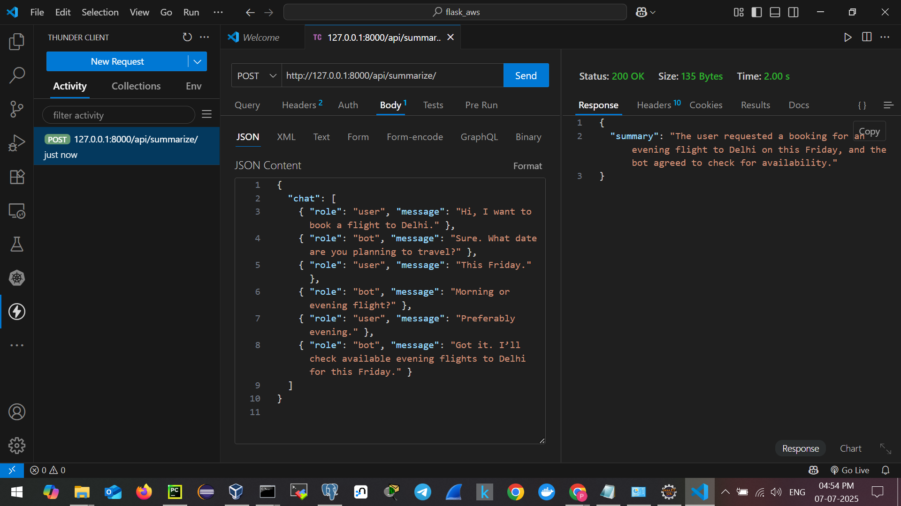

# Chat Summary Generator API (Django + LLM)

This Django-based backend service accepts a sequence of user and bot messages, processes the chat using a Large Language Model (LLM), and returns a concise **summary** of the entire conversation. This API is **production-ready**, modular, and testable using **Postman** or **cURL**.

---

## Features

- Accepts structured chat conversations (user + bot messages)
- Generates accurate summaries using LLMs (e.g., OpenAI GPT)
- RESTful API powered by **Django REST Framework**
- Unit tested with Django's test framework
- Easily testable using **Postman** or **cURL**

---

## Setup Instructions

Follow the steps below to set up the project on your local machine:

## Local LLM setup

You can use a local LLM instead of an external API. This is useful for privacy, cost-efficiency, or offline use.

Prerequisites
Install Ollama

Pull the llama3.2 model (or use any supported model):

```bash
ollama pull llama3.2:latest
````

### 1. Clone the Repository

```bash
git clone https://github.com/Prajval143/Chat-Summary-Generator.git
cd Chat-Summary-Generator
````

### 2. Create and Activate a Virtual Environment

```bash
python -m venv venv
# On Windows
venv\Scripts\activate
# On macOS/Linux
source venv/bin/activate
```

### 3. Install Dependencies

```bash
pip install -r requirements.txt
```

### 4. Run Development Server

```bash
python manage.py runserver
```

The server will start at: `http://127.0.0.1:8000/`

---

## Running Tests

To run unit tests for the `summarizer` app:

```bash
python manage.py test summarizer
```

---

## API Usage

### Endpoint

```
POST /api/summarize/
```


### Testing via cURL

```bash
curl -X POST http://127.0.0.1:8000/api/summarize/ -H "Content-Type: application/json" -d "{\"chat\": [{\"role\": \"user\", \"message\": \"Hi, I need help with my order.\"}, {\"role\": \"bot\", \"message\": \"Sure, can you provide your order ID?\"}]}"

```

```json
{"summary":"There is not enough information to summarize this conversation. The chat only contains two lines of text, and no specific details about the user's issue or order are provided."}
```
## 🖼️ Demo Screenshot


---

